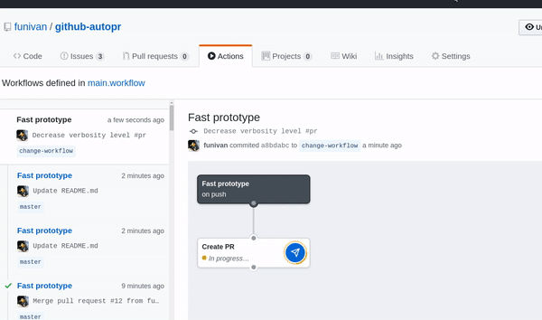

## Usage
This action automatically open Pull Request based on conditions.

Create PR for all commits.
```workflow
workflow "Fast prototype" {
  on = "push"
  resolves = ["Create PR"]
}

action "Create PR" {
  uses = "funivan/github-autopr@master"
  secrets = ["GITHUB_TOKEN"]
}
```

### Demo


## Filter
In every runtime environment for an Action we have file that holds the JSON 
data for the event [PushEvent payload](https://developer.github.com/v3/activity/events/types/#pushevent).
From that we can get the commit authors 
name and other important data. We can skip this action by checking this data.

## Arguments
- First argument - [JQ](https://stedolan.github.io/jq/) selector which will select data from the event data file
- Second argument: grep regex
- Third argument: verbosity level (`-v|-vv`)

## Examples
#### Create PR if the commit message contains `#pr` hashtag
```workflow
action "Create PR" {
  uses = "funivan/github-autopr@master"
  secrets = ["GITHUB_TOKEN"]
  args = ".head_commit.message .*#pr.*"
}
```
#### Check if branch ends with `-pr` word 
`args = ".repository.default_branch .*-pr"`

#### Output data that is used for the condition
Just add third parameter `-v`

```workflow
args = ".repository.default_branch .*-pr -v"
```

If you need to get output (responsebody) of the API call use `-vv` (very verbose level)
 
## How it works
Under the hood we will fetch commit message and check if it contains `#pr` word.
```
result=$(echo "some test commit message #pr" | grep "^.*#pr.*$" | wc -l )
```
If result is positive - we will continue our action. If negative - stop it immediately.
